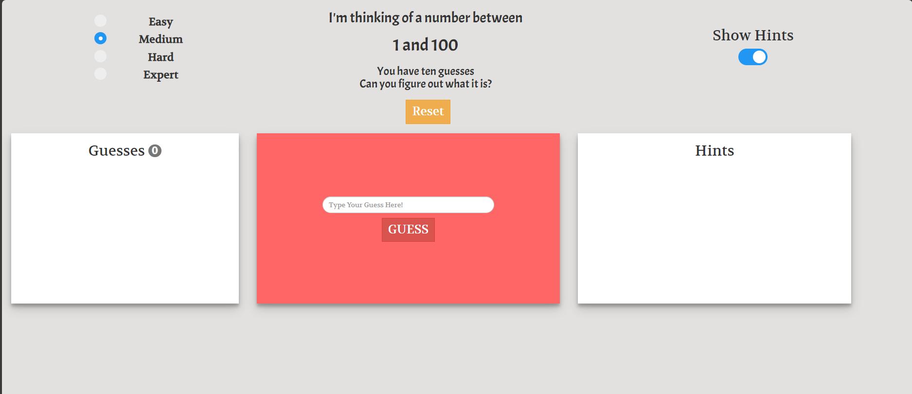

# guess-the-number

The classic guess the number game with some extra features.

Requirements: None

Installation / Contribution: 
    - Fork this repo
    - Create a branch within your own repo
        - Name convention of {issue-name}
    - Create a PR referencing the issue

Purpose:
    - This repo is a good opportunity for newer developers to contribute to an open source project. The game isn't of massive consequence but it's a good way for people to learn about how to use git!

[Try it](https://prateekkalra.github.io/guess-game)
